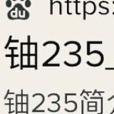

              
 
          
                                    

El Uranio-235, es (casi) el único elemento natural fisible, presente en la naturaleza con capacidad de provocar una reacción en cadena de fisión nuclear.

Para iniciar esta reacción en cadena, basta con un neutrón libre que toque el núcleo del U-235

Cuando un núcleo de uranio-235 absorbe un neutrón libre se divide en dos núcleos hijos más ligeros, fenómeno conocido como fisión nuclear. En el proceso se liberan dos o tres neutrones que, al impactar contra otros núcleos de U-235 prosiguen la reacción (reacción en cadena) 
  

Cada ser humano al ser tocado por su "electrón libre", también es capaz de formar una reacción en cadena

)  

铀u235

  

  
</a>

  

<>

  
</a>
